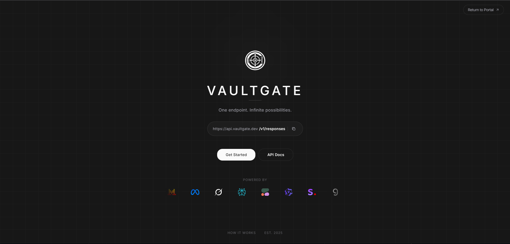
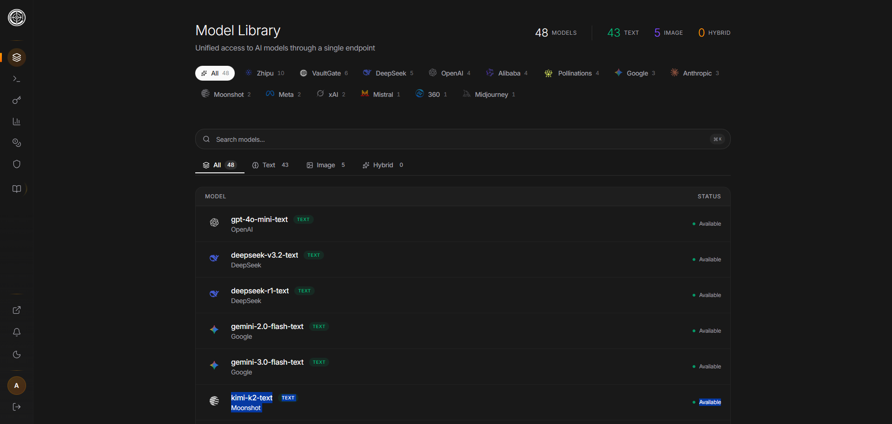
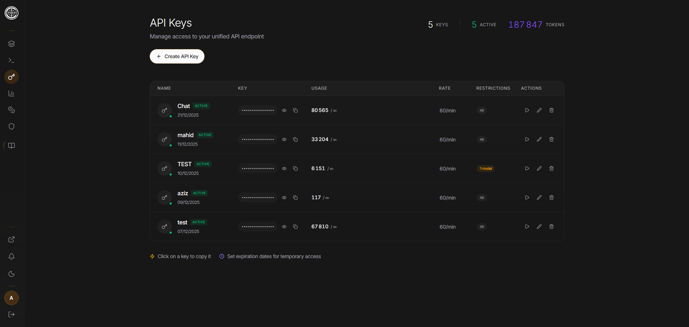
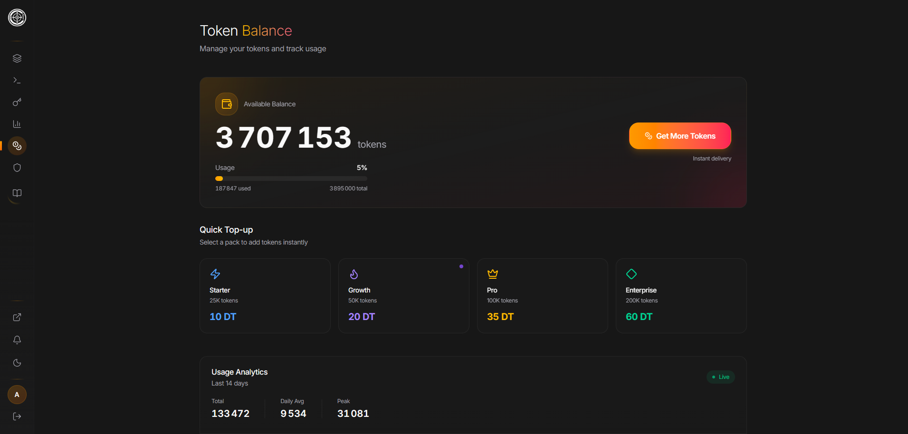
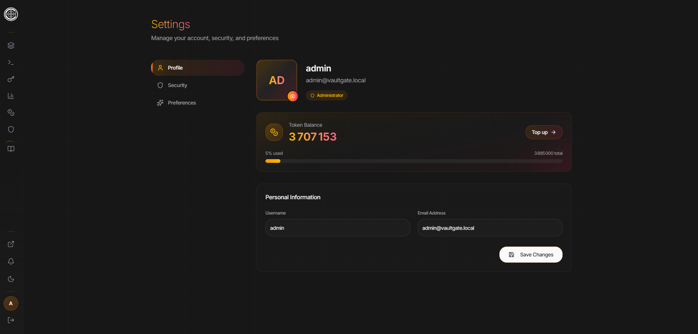
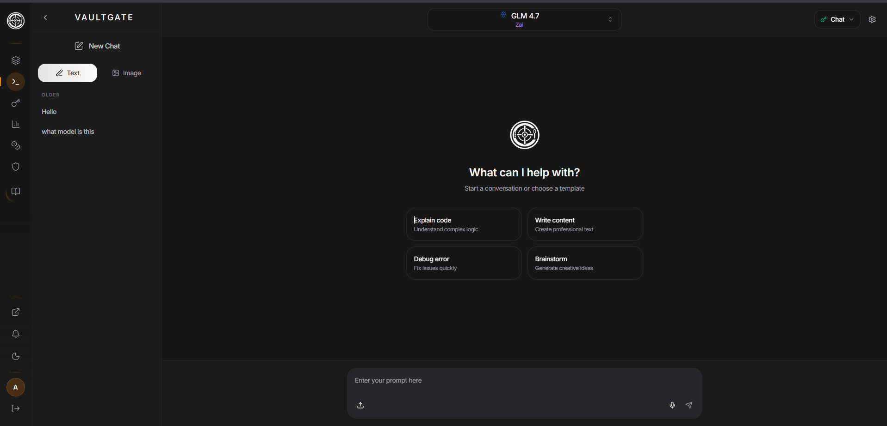
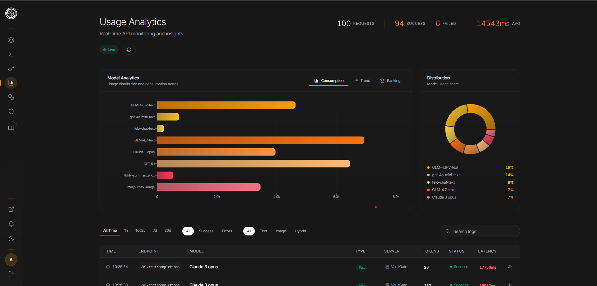
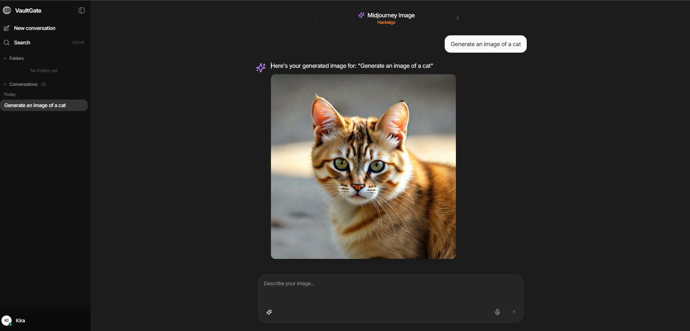
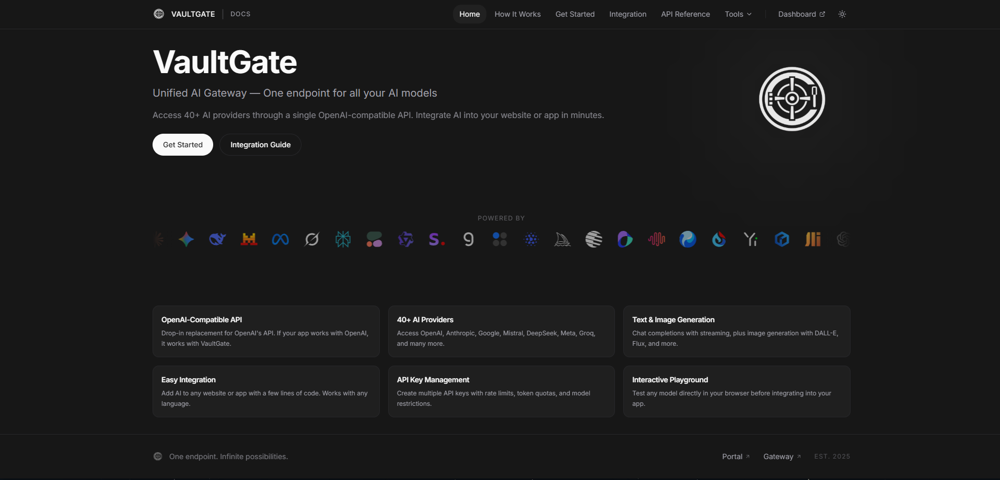

<p align="center">
  
</p>

<h1 align="center">VaultGate</h1>

<p align="center">
  <strong>Unified AI Gateway</strong><br/>
  One endpoint for all your AI models
</p>

<p align="center">
  <a href="https://vaultgate.dev">Website</a> |
  <a href="https://docs.vaultgate.dev">Documentation</a> |
  <a href="https://endpoint.vaultgate.dev">Dashboard</a> |
  <a href="https://chat.vaultgate.dev">Chat</a>
</p>

---

## Overview

VaultGate is a production-ready API gateway that unifies 40+ AI providers into a single OpenAI-compatible endpoint. Access models from OpenAI, Anthropic, Google, Mistral, DeepSeek, Meta, Groq, and more through one consistent API.

If your application works with OpenAI, it works with VaultGate. Just change the base URL and API key.

---

## Features

- OpenAI-Compatible API: Drop-in replacement for OpenAI's API format
- 100+ AI Models: Access text and image generation models from major providers
- Unified Endpoint: Single API for chat completions and image generation
- Real-time Streaming: Server-sent events for streaming responses
- API Key Management: Create keys with rate limits, token quotas, and model restrictions
- Interactive Playground: Test models directly in the browser
- Usage Analytics: Track requests, tokens, and costs per key
- Smart Failover: Automatic routing when primary providers are unavailable

---

## Getting Started

### Step 1: Create an Account

1. Visit [endpoint.vaultgate.dev/auth](https://endpoint.vaultgate.dev/auth)
2. Click "Register" to create a new account
3. Enter your email, username, and password
4. After registration, you will be redirected to the dashboard

### Step 2: Add Credits to Your Balance

1. Navigate to the "Balance" section in the sidebar
2. Add credits to your account using the available payment methods
3. Credits are used to pay for API requests based on token usage
4. You only pay for what you use, no subscriptions required

### Step 3: Generate an API Key

1. Go to the "API Keys" page from the sidebar
2. Click "Create API Key"
3. Enter a name for your key (e.g., "My Application", "Development", "Production")
4. Configure optional settings:
   - Rate Limit: Maximum requests per minute (default: 60)
   - Token Quota: Maximum tokens allowed for this key
   - Model Restrictions: Limit which models this key can access
5. Click "Create" and copy your API key immediately
6. Your key starts with `vg_` and will not be shown again after creation

### Step 4: Browse Available Models

1. Visit the "Models" page to see all available AI models
2. Filter models by type:
   - Text: Chat and completion models (GPT-4, Claude, Gemini, etc.)
   - Image: Image generation models (DALL-E, Flux, Midjourney, etc.)
   - Hybrid: Models that support both text and image
3. Filter by provider: OpenAI, Anthropic, Google, Mistral, Meta, and more
4. Note the model ID for use in your API requests (e.g., `gpt-4o-text`, `claude-3-5-sonnet-text`)

### Step 5: Test in the Playground

Before integrating into your application, test models in the browser:

1. Go to the "Playground" page
2. Select a model from the dropdown
3. Choose which API key to use for the request
4. Adjust settings:
   - Temperature: Controls randomness (0 = deterministic, 2 = creative)
   - Max Tokens: Limit response length
   - Streaming: Enable real-time response streaming
5. Type your message and send
6. View response time, token usage, and costs
7. Export conversations or copy generated code

### Step 6: Make Your First API Request

Use the unified endpoint with your API key:

**Chat Completion:**

```bash
curl https://api.vaultgate.dev/v1/chat/completions \
  -H "Content-Type: application/json" \
  -H "Authorization: Bearer vg_your_api_key" \
  -d '{
    "model": "gpt-4o-text",
    "messages": [
      {"role": "system", "content": "You are a helpful assistant."},
      {"role": "user", "content": "Hello!"}
    ],
    "stream": true
  }'
```

**Image Generation:**

```bash
curl https://api.vaultgate.dev/v1/images/generations \
  -H "Content-Type: application/json" \
  -H "Authorization: Bearer vg_your_api_key" \
  -d '{
    "model": "dall-e-3-image",
    "prompt": "A futuristic city at sunset",
    "n": 1,
    "size": "1024x1024"
  }'
```

### Step 7: Monitor Your Usage

1. Visit the "Logs" page to see all API requests
2. View details for each request:
   - Model used
   - Tokens consumed (prompt + completion)
   - Response time
   - Status (success/error)
3. Track spending and usage patterns over time
4. Set up alerts when approaching quota limits

---

## Workflow Summary

```
1. Register Account     -->  endpoint.vaultgate.dev/auth
2. Add Credits          -->  Balance page
3. Create API Key       -->  API Keys page (save your vg_* key)
4. Browse Models        -->  Models page (find model IDs)
5. Test in Playground   -->  Playground page (optional but recommended)
6. Integrate API        -->  Use https://api.vaultgate.dev/v1
7. Monitor Usage        -->  Logs page
```

---

## API Reference

### Base URL

```
https://api.vaultgate.dev/v1
```

### Authentication

All requests require a Bearer token in the Authorization header:

```
Authorization: Bearer vg_your_api_key
```

API keys are created from the dashboard and start with `vg_`. Each key can have its own rate limits and permissions.

### Endpoints

| Method | Endpoint | Description |
|--------|----------|-------------|
| GET | /v1/models | List all available models |
| POST | /v1/chat/completions | Generate chat completions (text) |
| POST | /v1/images/generations | Generate images from text prompts |

### Model Naming Convention

Model IDs include a type suffix to indicate their capabilities:
- `-text` for chat and completion models
- `-image` for image generation models
- `-hybrid` for models that support both text and image

Examples:
- `gpt-4o-text` - OpenAI GPT-4o for chat
- `claude-3-5-sonnet-text` - Anthropic Claude 3.5 Sonnet
- `dall-e-3-image` - OpenAI DALL-E 3 for images
- `gemini-1.5-pro-hybrid` - Google Gemini with multimodal support

### Chat Completions Request

```json
{
  "model": "gpt-4o-text",
  "messages": [
    {"role": "system", "content": "You are a helpful assistant."},
    {"role": "user", "content": "Your message here"}
  ],
  "temperature": 0.7,
  "max_tokens": 1000,
  "stream": true
}
```

| Parameter | Type | Description |
|-----------|------|-------------|
| model | string | Required. Model ID from /v1/models |
| messages | array | Required. Array of message objects with role and content |
| temperature | number | Sampling temperature 0-2 (default: 1) |
| max_tokens | integer | Maximum tokens to generate |
| stream | boolean | Enable streaming responses (default: false) |
| top_p | number | Nucleus sampling parameter 0-1 |

### Image Generation Request

```json
{
  "model": "dall-e-3-image",
  "prompt": "A description of the image you want",
  "n": 1,
  "size": "1024x1024"
}
```

| Parameter | Type | Description |
|-----------|------|-------------|
| model | string | Required. Image model ID |
| prompt | string | Required. Text description of the image |
| n | integer | Number of images to generate (default: 1) |
| size | string | Image dimensions (e.g., "1024x1024") |

### Error Codes

| Status | Description |
|--------|-------------|
| 400 | Bad Request - Invalid parameters |
| 401 | Unauthorized - Invalid or missing API key |
| 402 | Payment Required - Insufficient credits |
| 404 | Not Found - Model not available |
| 429 | Too Many Requests - Rate limit exceeded |
| 503 | Service Unavailable - Upstream provider error |

### Rate Limits

Rate limits are configured per API key. Default is 60 requests per minute. You can view and adjust limits in the API Keys page. When exceeded, you receive a 429 status code.

---

## Supported Providers

| Provider | Text Models | Image Models |
|----------|-------------|--------------|
| OpenAI | GPT-4o, GPT-4, GPT-3.5 | DALL-E 3 |
| Anthropic | Claude 3.5, Claude 3 | - |
| Google | Gemini Pro, Gemini Flash | Imagen |
| Mistral | Mistral Large, Codestral | - |
| Meta | Llama 3.1, Llama 3 | - |
| DeepSeek | DeepSeek V3, DeepSeek Coder | - |
| Groq | Llama, Mixtral | - |
| Flux | - | Flux Pro, Flux Dev |

View the complete list at [endpoint.vaultgate.dev/models](https://endpoint.vaultgate.dev/models)

---

## SDK Integration

VaultGate works with any OpenAI-compatible SDK. Simply change the base URL:

### Python (OpenAI SDK)

```python
from openai import OpenAI

client = OpenAI(
    api_key="vg_your_api_key",
    base_url="https://api.vaultgate.dev/v1"
)

response = client.chat.completions.create(
    model="gpt-4o-text",
    messages=[{"role": "user", "content": "Hello!"}]
)
```

### JavaScript/TypeScript

```javascript
import OpenAI from 'openai';

const client = new OpenAI({
  apiKey: 'vg_your_api_key',
  baseURL: 'https://api.vaultgate.dev/v1'
});

const response = await client.chat.completions.create({
  model: 'gpt-4o-text',
  messages: [{ role: 'user', content: 'Hello!' }]
});
```

### cURL

```bash
curl https://api.vaultgate.dev/v1/chat/completions \
  -H "Authorization: Bearer vg_your_api_key" \
  -H "Content-Type: application/json" \
  -d '{"model": "claude-3-5-sonnet-text", "messages": [{"role": "user", "content": "Hello!"}]}'
```

---

## VaultGate Chat

VaultGate Chat is a full-featured chat interface for interacting with AI models:

- Access at [chat.vaultgate.dev](https://chat.vaultgate.dev)
- Connect using your VaultGate API key
- Chat with any available text model
- Generate images with image models
- Conversation history and management
- Model switching within conversations
- Markdown rendering and code syntax highlighting
- Export and share conversations

---

## Screenshots

### Portal
The landing page provides quick access to VaultGate Chat and the Endpoint dashboard.

<p align="center">
  
</p>

### Endpoint Landing
The main dashboard landing page with overview and quick actions.

<p align="center">
  
</p>

### Models
Browse and filter available AI models by provider and type.

<p align="center">
  
</p>

### API Keys
Create and manage API keys with rate limits and permissions.

<p align="center">
  
</p>

### Balance
Add credits and track your spending.

<p align="center">
  
</p>

### Profile
Manage your account settings and preferences.

<p align="center">
  
</p>

### Playground
Test any model directly in your browser with real-time streaming.

<p align="center">
  
</p>

### Logs
View all API requests, token usage, and response times.

<p align="center">
  
</p>

### Chat Interface
A full-featured chat interface for interacting with AI models.

<p align="center">
  
</p>

### Documentation
Comprehensive API documentation and integration guides.

<p align="center">
  
</p>

---

## Project Structure

This repository contains four main components:

```
VaultGate/
├── VaultGate.portal/     # Landing page (React + Vite)
├── VaultGate.chat/       # Chat interface (React + Vite)
├── VaultGate.endpoint/   # API gateway dashboard and backend
│   ├── gateway/          # Dashboard frontend (Next.js)
│   └── gateway-server/   # API server (Deno)
└── VaultGate.docs/       # Documentation site (React + Vite)
```

---

## Technology Stack

### Frontend
- React 19
- Next.js 16
- TypeScript
- Tailwind CSS
- Framer Motion

### Backend
- Deno 2.0
- Turso (LibSQL)

### Infrastructure
- Vercel (Frontend hosting)
- Deno Deploy / Railway (Backend)

---

## Links

- Website: [vaultgate.dev](https://vaultgate.dev)
- Documentation: [docs.vaultgate.dev](https://docs.vaultgate.dev)
- Dashboard: [endpoint.vaultgate.dev](https://endpoint.vaultgate.dev)
- Chat: [chat.vaultgate.dev](https://chat.vaultgate.dev)
- API Base URL: [api.vaultgate.dev/v1](https://api.vaultgate.dev/v1)

---

## FAQ

**How do I get started?**
Create an account at endpoint.vaultgate.dev, add credits, generate an API key, and start making requests.

**Is VaultGate compatible with OpenAI SDKs?**
Yes. VaultGate is fully OpenAI-compatible. Change the base URL to `https://api.vaultgate.dev/v1` and use your VaultGate API key.

**What happens if a provider goes down?**
VaultGate includes smart failover. If a primary provider is unavailable, requests are automatically routed to backup providers when possible.

**How is pricing calculated?**
You pay per token used. Different models have different costs. Check the Models page for pricing details.

**Can I restrict which models an API key can access?**
Yes. When creating an API key, you can specify which models or model types the key is allowed to use.

**Is there a free tier?**
New accounts receive starter credits to test the platform. After that, you pay only for what you use.

---

## License

MIT License

---

<p align="center">
  <sub>Built with care by the VaultGate Team</sub>
</p>
